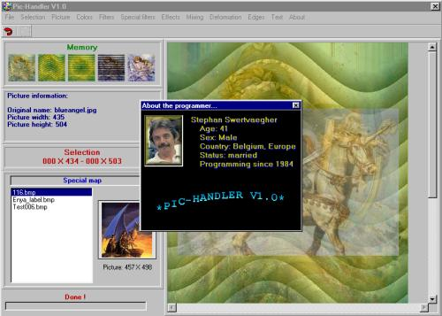



## Pic\-Handler V1\.0

### Description

155 commands, 146 picture-manipulations... 94k to download. With this prg you can load any existing picture, change it, play with

colors, mix with other graphics, filter it, turn it inside out... Save the changed picture (bmp-file) so you can use it

somewhere else. A few Api is used to speed things up. Anyway, I submit this prg coz some asked me to do so as a next step

to my filter and picture-manipulations. If you find bugs, please let me know. I coded this with care, but one never knows... Have fun.

Very important: this is NO drawing program (like paint or corel draw). It's just to manipulate graphics in an easy way.
 
### More Info
 

             |
---                |---
**Submitted On**   |2001-10-26 18:03:58
**By**             |[stephane swertvaegher](https://github.com/Planet-Source-Code/PSCIndex/blob/master/ByAuthor/stephane-swertvaegher.md)
**Level**          |Advanced
**User Rating**    |5.0 (100 globes from 20 users)
**Compatibility**  |VB 6\.0
**Category**       |[Complete Applications](https://github.com/Planet-Source-Code/PSCIndex/blob/master/ByCategory/complete-applications__1-27.md)
**World**          |[Visual Basic](https://github.com/Planet-Source-Code/PSCIndex/blob/master/ByWorld/visual-basic.md)
**Archive File**   |[Pic\-Handle3134910262001\.zip](https://github.com/Planet-Source-Code/stephane-swertvaegher-pic-handler-v1-0__1-28441/archive/master.zip)

